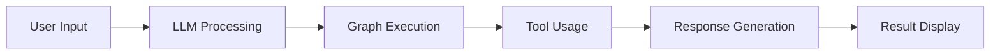

# Agentic-AI-Project

## 🤖 LangGraph: Build Stateful Agentic AI Graphs

[](https://www.python.org/downloads/)
[](https://streamlit.io/)
[](LICENSE)

## 📋 Overview

Agentic-AI-Project leverages the power of LangGraph to enable the creation of stateful, agentic AI workflows. This project provides a modular, extensible framework for building advanced AI agents that can reason, interact, and adapt using graph-based architectures. The intuitive Streamlit UI allows users to configure, run, and visualize agentic workflows with ease.

## ✨ Key Features

- **🔄 Stateful Agentic Graphs:** Build and manage AI agents as nodes in a dynamic graph
- **🧠 LLM Integration:** Seamless connection to Groq's powerful models
- **🛠️ Flexible Use Cases:** Pre-built chatbots and tool-enabled agents
- **🎯 Interactive UI:** User-friendly Streamlit interface
- **📦 Modular Design:** Extensible architecture for custom capabilities

## 🔄 Use Case Workflow

### 1. UI Configuration
```python
# Configure your agent through Streamlit UI
- Select LLM provider (e.g., Groq)
- Choose use case (Basic Chatbot/Chatbot with Tool)
- Pick model from available options
```

### 2. Agent Interaction Flow


## 🚀 Getting Started

### Prerequisites

- Python 3.8+
- Git
- PowerShell

### Installation

```powershell
# Clone the repository
git clone <your-repo-url>
cd langgraph_project

# Create and activate virtual environment
python -m venv venv
.\venv\Scripts\Activate

# Install dependencies
pip install -r requirements.txt
```

### Running the App

```powershell
# From the project root
streamlit run src/langgraphagenticai/app.py
```

## 📁 Project Structure

```
src/
└── langgraphagenticai/
    ├── app.py              # Application entry point
    ├── main.py            # Core application logic
    ├── ui/                # UI components and configuration
    ├── LLMS/              # LLM integration modules
    ├── graph/             # Graph construction logic
    ├── nodes/             # Agent node definitions
    ├── state/             # State management
    ├── tools/             # Agent tools and utilities
    └── vectorstore/       # Vector storage components
```

## 🛠️ Customization

### Adding New Use Cases
```python
# 1. Create a new node in nodes/
# 2. Define graph logic in graph/
# 3. Update UI configuration
```

### Integrating New LLMs
```python
# 1. Add LLM wrapper in LLMS/
# 2. Update uiconfigfile.ini
# 3. Extend UI options
```

## 📝 License

This project is licensed under the MIT License - see the [LICENSE](LICENSE) file for details.

## 🙏 Acknowledgements

- Built with [LangGraph](https://github.com/langchain-ai/langgraph)
- Powered by [Streamlit](https://streamlit.io/)
- LLM support by [Groq](https://groq.com/)

---

<div align="center">

**🚀 Empower your AI agents with stateful, agentic reasoning—start building with LangGraph today! 🚀**

</div>